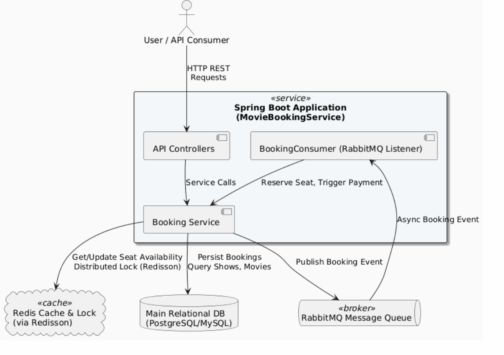

# MovieBookingApplication



A backend-focused Movie Booking Application built with Java and Spring Boot. This project demonstrates core movie ticketing concepts such as managing movies, theatres, shows, and seat reservations, and integrates caching and messaging for high performance and resiliency.

## Features

- **Movie & Theatre Management**: CRUD operations for movies, theatres, and shows via RESTful endpoints.
- **Show Scheduling**: Add, update, retrieve, and delete movie shows linked to theatres and rooms.
- **Seat Availability & Booking**: 
  - Check real-time seat availability for shows.
  - Book seats with strict consistency using distributed locks (Redisson).
- **Redis Integration**: 
  - Seat availability is cached in Redis for fast, concurrent reads.
  - Hash-based storage for efficient seat status lookups.
- **Message Queue Integration**: 
  - Uses RabbitMQ for decoupled, asynchronous operations (e.g., booking workflows, notifications).
- **Database Indexing**:
  - Indexing is implemented in the database layer to enable faster retrieval of frequently accessed data such as seats, shows, and bookings.

## Technologies Used

- **Backend**: Java, Spring Boot
- **Database**: JPA (e.g., with MySQL/PostgreSQL, configure as needed), with indexing for performance
- **Caching**: Redis (via RedisTemplate and Redisson for distributed locking)
- **Message Queue**: RabbitMQ
- **Build/Run**: Maven

## Getting Started

### Prerequisites

- Java 17+
- Maven
- Redis server running
- RabbitMQ server running
- Database PostgreSQL

### Setup & Run

1. **Clone the repository:**
   ```bash
   git clone https://github.com/namanpuri31/MovieBookingApplication.git
   cd MovieBookingApplication
   ```

2. **Configure `application.properties`:**
   - Set your Redis, RabbitMQ, and database connection properties.

3. **Start the application:**
   ```bash
   mvn spring-boot:run
   ```

## GitHub Actions CI/CD

The workflow in `.github/workflows/ci-cd.yml` runs automatically for pull requests and pushes to `main`.

- Builds and tests the application with Java 21.
- Starts temporary PostgreSQL, Redis, and RabbitMQ services for the tests.
- Uploads the built JAR as a GitHub Actions artifact after a successful push to `main`.

To use it:

1. Push this repository to GitHub.
2. Open the **Actions** tab and select **CI/CD**.
3. Download the `movie-booking-application` artifact from a successful `main` run.

This is delivery of the packaged application. A real deployment can be added later once a hosting provider and its required GitHub Secrets are chosen.

## API Endpoints

- `POST /admin/save-movie` — Add or update a movie
- `DELETE /admin/delete-movie/{id}` — Delete a movie
- `GET /admin/findall-movie` — List all movies
- `POST /admin/save-theatre` — Add a theatre
- `GET /admin/get-All-shows` — List all shows
- `GET /admin/seat-availability` — Get seat availability for all shows
- `POST /admin/seat-book/` — Book a seat and payment followed up

## Performance Optimizations

- **Redis** is used to cache seat availability, reducing database load and improving response times.
- **Redisson** provides distributed locking to ensure atomic seat booking, preventing double-booking in concurrent environments.
- **Database Indexing** is applied to speed up queries on commonly accessed fields like seat IDs, show IDs, and booking data.

## Message Queue

- **RabbitMQ** is configured for handling asynchronous tasks, making the system extensible for future requirements like notifications or analytics.

---

*For questions or contributions, please open an issue or submit a pull request.*
